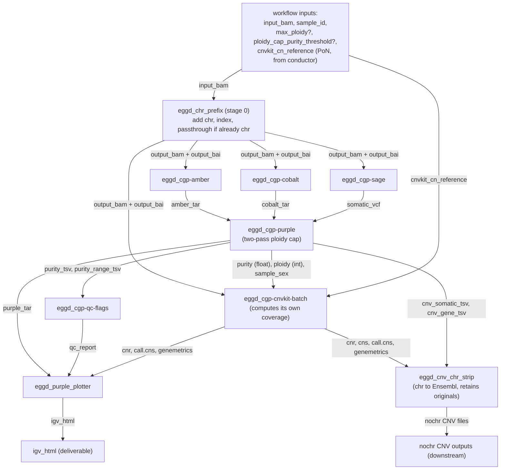
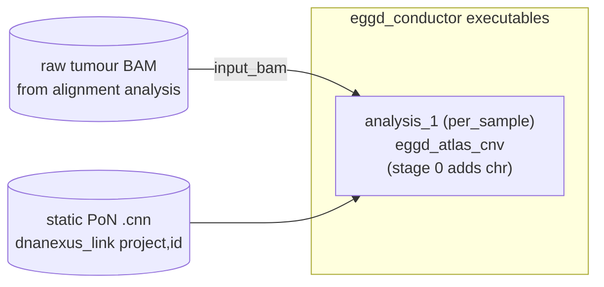
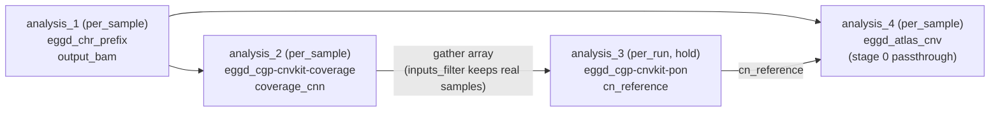

# DESIGN — eggd_atlas_cnv

## 1. Problem statement / context

CGP + backbone somatic panel samples were previously analysed by two independent
DNAnexus efforts:

- **`cnv-backbone-purple-atlas`** — a workflow (`cgp-cnv-somatic`) of *applets*
  running AMBER + COBALT + SAGE → PURPLE → QC-flags (+ SIGS/CUPpa/CHORD) for
  genome-wide (~50 kb) copy number, purity and ploidy.
- **`cnv-genes-atlas`** — three *apps* (`eggd_cgp-cnvkit-coverage`, `-pon`, `-batch`)
  running CNVkit for focal gene-level (~2–10 kb) copy number, plus
  `eggd_purple_plotter` for a combined IGV.js viewer.

`eggd_atlas_cnv` unifies these into a single **per-sample workflow built entirely from
DNAnexus apps**. Four requirements drive the design beyond a straight merge:

1. **Applets → apps.** The five HMF-tools applets (AMBER, COBALT, SAGE, PURPLE,
   QC-flags) must be reissued as versioned, namespaced apps (`org-emee_1`).
2. **Maximum-ploidy control.** PURPLE must accept either a hard ploidy cap
   (`max_ploidy`) or a purity-conditional cap ("if purity < T then max_ploidy = C").
   PURPLE currently exposes no such control in the applet.
3. **Flexible CNVkit reference.** CNVkit must either use a supplied PoN `.cnn` or build
   a fresh one from the run's samples — chosen at the **run** level, without rebuilding
   the PoN once per sample.
4. **chr-prefixing folded in as stage 0.** `eggd_chr_prefix` is used only by this
   pipeline, so it becomes the workflow's first stage rather than an upstream
   prerequisite. It is adapted for single-file, per-sample use (single-file I/O +
   passthrough when the BAM is already prefixed) so every downstream tool receives a
   chr-prefixed GRCh38 BAM regardless of the input naming.
5. **chr-stripping the CNV text outputs for downstream apps.** Downstream tools expect
   Ensembl chromosome names (`1..22,X,Y,MT`), but PURPLE/CNVkit emit chr-prefixed CNV
   files. A dedicated final stage (`eggd_cnv_chr_strip`) writes `*.nochr.*` copies of the
   CNV text files (chromosome column only; `chrM`→`MT`), **retaining the chr-prefixed
   originals** (CNVkit's own outputs; PURPLE's inside `purple_tar`). Stripping is a
   separate stage, not baked into the producing apps.

DNAnexus native workflows (`dxworkflow.json`) are **static DAGs**: no `if`/`else`, no
scatter, no runtime graph changes. Requirement (2) is implemented *inside* the PURPLE app.
Requirement (3) is **not** a workflow concern at all — it is solved one level up, by the
`eggd_conductor` orchestrator (§13): the PoN is a workflow *input*, and when it must be
built it is built **once per run** as a per-run conductor step and linked into every
per-sample job. Inter-stage scalars (purity, ploidy, sex) are passed as **typed job
outputs** rather than parsed from files at link time.

## 2. External tools & the DNAnexus workflow model

### 2.1 HMF tools (via bundled JARs, passed as file inputs)

| Tool | Version | Role | Key output consumed downstream |
|---|---|---|---|
| AMBER | 4.3-beta.4 | BAF per germline site | `{s}.amber.tar.gz` → PURPLE |
| COBALT | 3.0-beta.5 | Read-depth ratios | `{s}.cobalt.tar.gz` → PURPLE |
| SAGE | 5.0-beta.11 | Somatic SNV/indel VCF (panel mode) | `{s}.sage.somatic.vcf.gz` → PURPLE, QC |
| PURPLE | 4.4-beta.12 | Purity/ploidy + CN segments | `{s}.purple.tar.gz`, `{s}.purple.purity.tsv` |

**PURPLE fitting arguments** (verified against hmftools/purple README): `min_ploidy`
(default 1), `max_ploidy` (default 8), `min_purity` (0.08), `max_purity` (1.0),
`somatic_min_purity` (0.17). `eggd_atlas_cnv` uses **`-max_ploidy`** to implement the cap.

### 2.2 CNVkit (via bundled Docker image)

`cnvkit.py coverage / reference / fix / segment / call / scatter / diagram /
genemetrics`. Amplicon mode (no antitargets). Integer CN calling uses PURPLE purity
only when purity > 0.40 (unreliable below in FFPE WGD samples).

### 2.3 DNAnexus workflow model — the three constraints that shape this design

1. **Static DAG.** Stages and links are fixed at build time. → the only in-workflow
   conditional logic lives inside `eggd_cgp-purple` (the ploidy cap).
2. **Links pass DNAnexus data objects, not parsed scalars.** A stage cannot read a
   float out of another stage's output *file*. → PURPLE emits `purity` (float) and
   `ploidy` (int) as **typed job outputs**, linked directly into CNVkit batch.
3. **Every stage always runs; the graph cannot branch.** → the PoN "build vs reuse"
   choice is moved out of the workflow entirely and handled by `eggd_conductor` as a
   per-run step (§13). The workflow just takes `cnvkit_cn_reference` as an input.

### 2.4 Scalar (typed) outputs and stage linking

PURPLE passes purity/ploidy/sex to CNVkit as **scalar job outputs**, not files. This works
because DNAnexus outputs are typed and scalars are handled differently from data objects:

- A DNAnexus executable declares a typed `outputSpec`. **Data-object** outputs (`file`,
  `record`) are stored as `$dnanexus_link` references to objects; **scalar** outputs
  (`int`, `float`, `string`, `boolean`, and `hash`/`array:*`) are stored as **literal JSON
  values in the job's output hash** — no file is created.
- An app emits a scalar with `dx-jobutil-add-output <name> <value> --class=<class>`, e.g.
  `dx-jobutil-add-output purity 0.29 --class=float`. The value becomes a bare number/string
  in the job output hash.
- A workflow stage input is wired to an upstream output with a **job-based object
  reference (JBOR)** — the same `$dnanexus_link` syntax used for files, valid for any
  class: `{"$dnanexus_link": {"stage": "purple", "outputField": "purity"}}` (in
  `dxworkflow.json`) or `{"$dnanexus_link": {"analysis": "analysis_N", "field": "purity"}}`
  (in an eggd_conductor config).

Properties that the design relies on:

1. **Resolved at runtime, not at launch.** The JBOR is a promise; the platform substitutes
   the real scalar into the downstream input once the producing job finishes. Its value
   need not be known at `dx run` time.
2. **The link creates a dependency edge.** Linking `cnvkit_batch.purity ← purple.purity`
   makes `cnvkit_batch` wait for `purple` — exactly the DAG in §3.
3. **Classes must match.** The downstream input class must equal the linked output class.
   PURPLE therefore emits `ploidy` as a **rounded int** (floor 1) because
   `cnvkit_batch.ploidy` is class `int`; a `float`→`int` link fails validation.
4. **`dx build --workflow` validates the link** at build time (field exists in the
   upstream `outputSpec`, class compatible) — a typo/mismatch fails the build, not silently
   at runtime.
5. **Native links reference a whole output field only.** There is no expression language to
   reach *inside* a file (you cannot link the `purity` column of `purity_tsv`). This is the
   sole reason PURPLE promotes purity/ploidy/sex to first-class scalar outputs rather than
   leaving them only inside `purity_tsv`. (The same limitation — no array indexing in
   native links — is why chr_prefix was adapted to single-file outputs; §4.0.)

**Gotcha:** the producer must *always* emit the scalar. If `code.sh` skips
`dx-jobutil-add-output` on some path, the JBOR resolves to nothing and the downstream
stage fails — PURPLE emits purity/ploidy/sample_sex unconditionally on its final pass.

DNAnexus references: [Job Input and Output](https://documentation.dnanexus.com/developer/api/running-analyses/job-input-and-output)
(JBORs, output hash) · [I/O and Run Specifications](https://documentation.dnanexus.com/developer/api/running-analyses/io-and-run-specifications)
(output classes) · [Workflows and Analyses](https://documentation.dnanexus.com/developer/api/running-analyses/workflows-and-analyses)
and [Introduction to Building Workflows](https://documentation.dnanexus.com/developer/workflows/intro-to-building-workflows)
(stage input binding / `workflowInputField`) · [Path resolution — JBORs](https://documentation.dnanexus.com/user/projects/path-resolution).

## 3. Architecture



Stage 0 (`eggd_chr_prefix`) adds the `chr` prefix and produces the indexed BAM that AMBER,
COBALT, SAGE and CNVkit-batch all consume. Those four fan out in parallel. PURPLE waits
for AMBER+COBALT+SAGE. CNVkit-batch waits for PURPLE's scalar purity/ploidy. The plotter
(chr-prefixed inputs, for igv.js/hg38) and `eggd_cnv_chr_strip` (Ensembl-named copies for
downstream) are the two terminal joins. The PoN (`cnvkit_cn_reference`) enters as a plain
workflow input — supplied directly, or produced by a per-run conductor step (§13).

### 3.1 Workflow-level outputs

`dxworkflow.json` declares an explicit `outputs` block (see §2.4 / REFERENCE §3 for how
workflow outputs are links to stage outputs — curated pointers, not copies). This gives
`eggd_atlas_cnv` a stable public interface so downstream consumers and `eggd_conductor`
reference `atlas.<name>` rather than `atlas.stage-<id>.<field>`. The CNV call files are
promoted in their **chr-stripped** (`*_nochr`) form, since downstream apps expect Ensembl
names; the chr-prefixed originals stay reachable as stage outputs. The promoted outputs:

| Workflow output | Class | Linked stage output | Meaning |
|---|---|---|---|
| `igv_html` | file | purple_plotter.igv_html | **primary deliverable** — combined IGV viewer |
| `qc_report` | file | qc_flags.qc_report | purity/ploidy/flags summary TSV |
| `purple_cnv_somatic_nochr` | file | cnv_chr_strip.purple_cnv_somatic_nochr | PURPLE segment-level CN calls (Ensembl-named) |
| `purple_cnv_gene_nochr` | file | cnv_chr_strip.purple_cnv_gene_nochr | PURPLE gene-level CN calls (Ensembl-named) |
| `cnvkit_call_cns_nochr` | file | cnv_chr_strip.cnvkit_call_cns_nochr | CNVkit integer CN calls (Ensembl-named) |
| `cnvkit_genemetrics_nochr` | file | cnv_chr_strip.cnvkit_genemetrics_nochr | CNVkit per-gene metrics (Ensembl-named) |
| `cnvkit_cnr_nochr` | file | cnv_chr_strip.cnvkit_cnr_nochr | CNVkit per-bin log2 ratios (Ensembl-named) |
| `purple_tar` | file | purple.purple_tar | full PURPLE output archive (chr-prefixed) |
| `purity` | float | purple.purity | fitted purity (final pass) |
| `ploidy` | int | purple.ploidy | fitted ploidy (rounded) |

The **chr-prefixed** CNV originals (`cnvkit_batch.call_segments`, `.genemetrics`,
`.copy_ratios`, `.segments`; PURPLE `cnv_somatic_tsv`/`cnv_gene_tsv`; contents of
`purple_tar`) remain available on the analysis as `stage-<id>.<field>` — retained, just not
promoted. AMBER/COBALT tars, the SAGE VCF, plots, and scalar `sample_sex` likewise remain
as intermediates.

## 4. Module responsibilities

Apps are grouped as **converted** (was an applet), **new**, and **reused** (already an app).

### 4.0 `eggd_chr_prefix` (folded in, adapted) — stage 0

- Responsible for: adding the `chr` prefix to the input BAM header (`samtools reheader`),
  generating the `.bai`, and emitting **exactly one** BAM + index for the sample.
- Adapted from the public `eggd_chr_prefix` (array-in/array-out, `add_chr`/`remove_chr`)
  for single-file per-sample use inside the workflow. Required modifications:
  1. **Single-file I/O.** Input `input_bam` (file); outputs `output_bam` (file) and
     `output_bai` (file). The array inputs/outputs of the public app are not used, so a
     stage output can link directly into a single-file downstream input.
  2. **Passthrough when already prefixed.** The public app emits *nothing* when the BAM
     is already in the target format; that would starve downstream stages. The folded-in
     app must instead emit the input BAM (with a generated/copied `.bai`) unchanged. This
     makes the workflow robust to both Ensembl-named and already-chr-prefixed inputs.
  3. **Mode fixed to `add_chr`.** Not exposed as a workflow input.
- Must NOT alter read data — header reheader only. Must NOT require the input to be indexed.
- Public interface: `input_bam` (file) → `output_bam` (file), `output_bai` (file).

**chr-prefix algorithm (numbered):**

1. Extract the header (`samtools view -H`) and apply the `add_chr` transform (sed):
   `1..22 → chr1..chr22`, `X → chrX`, `Y → chrY`, `MT → chrM` (matching chr-prefixed
   GRCh38 references; note `MT`→`chrM`, not `chrMT`). Non-primary contigs are prefixed the
   same way; already-`chr` names are left unchanged by the transform.
2. If the transformed header equals the original (already chr-prefixed) → **passthrough**:
   emit the input BAM as `output_bam`, index it (`samtools index`) as `output_bai`. Done.
3. Else reheader (`samtools reheader`) into `output_bam`, index into `output_bai`. Done.

### 4.1 `eggd_cgp-amber` (converted) / `eggd_cgp-cobalt` (converted) / `eggd_cgp-sage` (converted)

- Responsible for: running the tool exactly as the legacy applet did (same flags), then
  packaging output as a tar (AMBER/COBALT) or VCF+tbi (SAGE).
- Conversion changes only: (a) app metadata (`version`, `developers`, `authorizedUsers`);
  (b) an explicit `timeoutPolicy`; (c) moving inline `apt-get` installs into
  `runSpec.execDepends` (or a bundled Docker asset) so no run-time network is required.
- Must NOT change any tool flag, reference input, or output name — downstream links and
  the legacy validation depend on them.
- Public interface (unchanged from applet): see REFERENCE §1.

### 4.2 `eggd_cgp-purple` (converted + extended) — the ploidy-cap state machine

- Responsible for: running PURPLE, optionally capping ploidy, packaging `purple_tar`,
  and **emitting purity/ploidy/sex as typed scalar outputs** for downstream linking (see
  §2.4 for how scalar outputs and JBOR stage-linking work).
- New inputs: `max_ploidy` (int, optional), `ploidy_cap_purity_threshold` (float,
  optional), `ploidy_cap_value` (int, optional, default 2).
- New outputs: `purity` (float), `ploidy` (int), `sample_sex` (string), plus the CNV call
  TSVs `cnv_somatic_tsv` (`{s}.purple.cnv.somatic.tsv`, segment-level CN) and `cnv_gene_tsv`
  (`{s}.purple.cnv.gene.tsv`, gene-level CN), in addition to the existing `purple_tar`,
  `purity_tsv`, `purity_range_tsv`, `plots_tar`. The two CNV TSVs were previously only
  inside `purple_tar`; they are now surfaced as standalone file outputs so they can be
  promoted to workflow outputs (the direct analogues of CNVkit's `call.cns`/`genemetrics`).
- Must NOT run PURPLE more than twice, and must NOT re-run AMBER/COBALT (the second
  fitting pass reuses the same AMBER/COBALT dirs — PURPLE fitting is cheap, it does not
  re-read the BAM).
- **Promoted outputs must always exist.** `purity`, `ploidy`, `sample_sex`,
  `cnv_somatic_tsv`, and `cnv_gene_tsv` are emitted unconditionally on the final pass so
  downstream JBORs never break. If PURPLE omits a CNV TSV (some `NO_TUMOR`/failed fits),
  `code.sh` writes a header-only file of the expected name before uploading. `purity.tsv`
  always carries numeric `purity`/`ploidy` (for `NO_TUMOR`, purity is PURPLE's `1.0`
  sentinel; the best-fit recovery lives in qc-flags, §4.3), so the scalar parser never sees
  a blank — but see §6 for the parse-error guard.
- The decision is delegated to the bundled pure-Python helper `atlas_helpers.ploidy_gate`
  (see §5, §4.7). `code.sh` calls it to obtain the extra PURPLE args and the re-run flag.

**Ploidy-cap algorithm (numbered — implemented across `code.sh` + `ploidy_gate.py`):**

1. **Resolve mode.** Read `max_ploidy`, `ploidy_cap_purity_threshold`, `ploidy_cap_value`.
   - If `max_ploidy` is set → **STATIC** mode.
   - Else if `ploidy_cap_purity_threshold` is set → **CONDITIONAL** mode.
   - Else → **NONE** (default PURPLE behaviour).
2. **STATIC:** run PURPLE once with `-max_ploidy <max_ploidy>`. Skip to step 6.
3. **NONE:** run PURPLE once with no ploidy bound. Skip to step 6.
4. **CONDITIONAL — pass 1:** run PURPLE unbounded. Parse `purity` from
   `{s}.purple.purity.tsv` (column `purity`).
5. **CONDITIONAL — decide:** if `purity < ploidy_cap_purity_threshold`, delete pass-1
   output dir and re-run PURPLE with `-max_ploidy <ploidy_cap_value>` (**pass 2**).
   Otherwise keep pass-1 output.
6. **Emit.** Parse final `purity`, `ploidy`, and `gender`→`sample_sex` from
   `{s}.purple.purity.tsv`; locate `{s}.purple.cnv.somatic.tsv` and `{s}.purple.cnv.gene.tsv`
   in the output dir; `tar` the output dir; emit `purple_tar`, the two purity TSVs, the two
   CNV TSVs (`cnv_somatic_tsv`, `cnv_gene_tsv`), the scalar outputs, and (if present)
   `plots_tar`.

### 4.3 `eggd_cgp-qc-flags` (converted)

- Responsible for: reading `{s}.purple.purity.tsv` (+ `.purple.purity.range.tsv` for
  `NO_TUMOR`) and emitting `{s}.qc_report.tsv` with flags (`PURITY_FLOOR`,
  `WGD_SUSPECT`, `FLAT_GENOME`, `WIDE_CI`, `NO_TUMOR_BESTFIT`, `LOW_SNV_COUNT`).
- Conversion changes only: app metadata + `timeoutPolicy`. Logic unchanged.
- `sigs_allocation` and `cup_summary` inputs remain optional and are **left unlinked**
  in v0.1 (SIGS/CUPpa out of scope).
- Must NOT change the `qc_report.tsv` column order — the plotter reads it by name.

### 4.4 `eggd_cgp-cnvkit-batch` (reused) — the only CNVkit stage in the workflow

- Reused unchanged in behaviour; only rebuilt as the current app version.
- Takes `tumour_bam`, `cn_reference` (the supplied/linked PoN), `baits`, and the optional
  `purity`, `ploidy`, `sample_sex` linked from PURPLE's scalar outputs. It **computes its
  own on-target coverage internally** (coverage → fix → segment → call → plot →
  genemetrics), so the workflow needs no separate coverage stage.
- Applies `--purity/--ploidy` for integer CN calling only when `purity > 0.40`
  (unreliable below in FFPE WGD samples); `sample_sex` corrects the diagram chrX/Y baseline.
- Must NOT build or modify the PoN — it consumes `cn_reference` read-only.
- Integration note: `batch` outputs `{s}.genemetrics.tsv`; the plotter's input pattern
  is `*.genemetrics.csv`. See §8.1 (must be reconciled).

### 4.4a PoN provenance (not a workflow stage)

The `cn_reference` PoN is **never built by the workflow**. It arrives as a workflow input,
sourced by `eggd_conductor` either as a static file (PoN provided) or as the output of a
per-run `eggd_cgp-cnvkit-pon` job (PoN built once per run). See §13 for the orchestration.
The existing `eggd_cgp-cnvkit-coverage` and `eggd_cgp-cnvkit-pon` apps are reused verbatim
for that per-run build — no new reference/resolver app is created.

### 4.6 `eggd_purple_plotter` (reused)

- Reused unchanged. Takes `purple_tar`, `qc_report`, `cnvkit_cnr` (`copy_ratios`),
  `cnvkit_call_cns` (`call_segments`), `cnvkit_genemetrics` (`genemetrics`), emits
  `igv_html`. Handles missing optional inputs gracefully.
- Consumes the **chr-prefixed** CNVkit/PURPLE files (igv.js renders against hg38 with
  `chr` names) — it must NOT be wired to the `eggd_cnv_chr_strip` outputs.

### 4.6a `eggd_cnv_chr_strip` (NEW) — final stage, Ensembl-named CNV copies

- Responsible for: writing chr-stripped (`*.nochr.*`) copies of the CNV text files for
  downstream apps, **without altering the originals**.
- Inputs (all optional so the app degrades gracefully; the workflow links all six):
  `sample_id`; CNVkit `cnvkit_cnr`, `cnvkit_cns`, `cnvkit_call_cns`, `cnvkit_genemetrics`;
  PURPLE `purple_cnv_somatic`, `purple_cnv_gene`.
- Outputs: a `*_nochr` file per supplied input (`{s}.nochr.cnr`, `{s}.nochr.cns`,
  `{s}.nochr.call.cns`, `{s}.nochr.genemetrics.tsv`, `{s}.purple.cnv.somatic.nochr.tsv`,
  `{s}.purple.cnv.gene.nochr.tsv`).
- Must NOT modify its input files (CNVkit originals live in `cnvkit_batch`'s outputs;
  PURPLE originals live in `purple_tar` — both retained). Must rewrite **only the
  `chromosome` column**, leaving gene names, every other column, and the line terminators
  unchanged (line-preserving rewrite, not a CSV round-trip).
- Delegates the transform to the bundled pure-Python helper `atlas_helpers.chr_strip` (§4.7).

**chr-strip algorithm (numbered):**

1. For each supplied input file, read the header and locate the `chromosome` column by
   name (raise `ChrColumnError` if absent).
2. Stream rows, rewriting only that column via `strip_chrom`: `chr1..chr22 → 1..22`,
   `chrX/chrY → X/Y`, `chrM`/`chrMT → MT`; a value with no `chr` prefix is left unchanged
   (idempotent).
3. Write the `*.nochr.*` copy (header preserved); a header-only input yields a header-only
   output (handles PURPLE's `NO_TUMOR` fallback files).
4. Emit each `*_nochr` output; skip cleanly for any input not supplied.

### 4.7 `atlas_helpers/` (pure Python — the testable core)

Three modules with **no dxpy dependency**, unit-tested in `tests/`, bundled into the app
that calls each (`ploidy_gate`/`purity` → PURPLE; `chr_strip` → `eggd_cnv_chr_strip`).

- `ploidy_gate.py` — `decide(purity, max_ploidy, threshold, cap_value) -> PloidyDecision`
- `purity.py` — `read_purity_ploidy(path) -> PurityFit`
- `chr_strip.py` — `strip_chrom(name) -> str` and `strip_file(in, out, chrom_column=None) -> int`

Must NOT import dxpy or make network calls. `ploidy_gate` has no I/O; `purity` only reads a
local TSV; `chr_strip` reads one local TSV and writes one local TSV (its declared job).
(The PoN passthrough-vs-build decision from the earlier design is gone: it is now an
orchestration concern handled by `eggd_conductor`, not code in this repo.)

## 5. Data model

```python
# atlas_helpers/purity.py
@dataclass(frozen=True)
class PurityFit:
    purity: float          # col 'purity' of *.purple.purity.tsv
    ploidy: float          # col 'ploidy'
    status: str            # col 'status' (NORMAL / NO_TUMOR / ...)
    sample_sex: str        # col 'gender' -> 'male'|'female' (lowercased for cnvkit)
    def ploidy_int(self) -> int:      # rounded, min 1, for cnvkit --ploidy
        return max(1, round(self.ploidy))

# atlas_helpers/ploidy_gate.py
class PloidyMode(str, Enum):
    NONE = "none"; STATIC = "static"; CONDITIONAL = "conditional"

@dataclass(frozen=True)
class PloidyDecision:
    mode: PloidyMode
    first_pass_args: list[str]        # e.g. [] or ["-max_ploidy", "2"]
    conditional: bool                 # True if a purity-gated re-run may be needed
    cap_value: int                    # ploidy cap applied on re-run
    threshold: float | None           # purity threshold for the re-run

    def needs_rerun(self, fitted_purity: float) -> bool:
        return self.conditional and fitted_purity < self.threshold
    def rerun_args(self) -> list[str]:
        return ["-max_ploidy", str(self.cap_value)]
```

(There is no CNVkit-reference data model: PoN resolution is handled by `eggd_conductor`
config, not by code in this repo.)

```python
# atlas_helpers/chr_strip.py
class ChrColumnError(ValueError): ...

def strip_chrom(chrom: str) -> str:
    # 'chr1'->'1', 'chrX'->'X', 'chrM'/'chrMT'->'MT'; no-prefix -> unchanged (idempotent)
    ...

def strip_file(in_path, out_path, chrom_column: str | None = None) -> int:
    # rewrite ONLY the chromosome column (found by header name); return rows rewritten
    ...
```

## 6. Error handling strategy

| Condition | Where raised | Behaviour |
|---|---|---|
| `max_ploidy` set AND `ploidy_cap_purity_threshold` set | `ploidy_gate.decide` → `PloidyConfigError` | Fail fast: mutually exclusive |
| `max_ploidy` < 1 or `ploidy_cap_value` < 1 | `ploidy_gate.decide` → `PloidyConfigError` | Fail fast |
| `ploidy_cap_purity_threshold` outside `(0, 1]` | `ploidy_gate.decide` → `PloidyConfigError` | Fail fast (a purity threshold must be a fraction) |
| `{s}.purple.purity.tsv` missing after a PURPLE pass | `eggd_cgp-purple` `code.sh` | Non-zero exit; PURPLE run failed |
| purity column non-numeric / absent (incl. NaN) | `purity.read_purity_ploidy` → `PurityParseError` | Fail fast (PURPLE always writes numeric purity/ploidy; a blank means a broken run) |
| CNV TSV absent from PURPLE output dir (some `NO_TUMOR`/failed fits) | `eggd_cgp-purple` `code.sh` | Write a header-only `cnv_somatic_tsv`/`cnv_gene_tsv` so the promoted output always exists |
| No `cn_reference` provided to the workflow | workflow input (required) | Run fails at launch: `cnvkit_cn_reference` is a required input |
| Per-run PoN build gathered no coverage files | `eggd_cgp-cnvkit-pon` (existing) | Non-zero exit (existing app behaviour) |
| AMBER < 5000 BAF sites | `eggd_cgp-amber` `code.sh` (legacy guard) | Non-zero exit |
| CNV text file has no `chromosome` header column | `chr_strip.strip_file` → `ChrColumnError` | Fail fast (unexpected file format) |
| plotter given neither `purple_tar` nor `cnvkit_cnr` | `eggd_purple_plotter` (existing) | Non-zero exit |

The workflow itself has no error handling — a failed stage fails the analysis; DNAnexus
reports which stage.

## 7. Testing strategy

Red/Green TDD applies to the **pure-Python helpers** and the **workflow JSON**, which
are fully testable without DNAnexus. App `code.sh` and end-to-end runs are integration
tests gated on real credentials (hand to a human).

| Unit under test | Mock / fixture | Key assertions |
|---|---|---|
| `ploidy_gate.decide` | none (pure) | NONE/STATIC/CONDITIONAL modes; mutual-exclusion error; `needs_rerun` boundary at threshold |
| `purity.read_purity_ploidy` | golden `purity.tsv` fixture | correct purity/ploidy/status/sex; `ploidy_int` rounding; parse errors (incl. NaN) |
| `chr_strip.strip_chrom` / `strip_file` | in-memory TSV fixtures | `chr1→1`, `chrM→MT`, idempotent; only the `chromosome` column changed (gene names untouched); header-only in→out; `ChrColumnError` when no chromosome column |
| `dxworkflow.json` | the built JSON | every `outputField` link references a real upstream app output (class-checked); downstream BAMs come from `chr_prefix`; CNV `*_nochr` outputs come from `cnv_chr_strip`; 9 stages present |
| `conductor` executables block | the example JSON | per-run `pon` step `depends_on` the coverage step; `atlas` step links `cnvkit_cn_reference` from the pon analysis |

**Acceptance criteria for v0.1:**

- [ ] `pytest tests/ -v` green with no DNAnexus connection.
- [ ] `ploidy_gate` correctly returns a re-run for purity below the threshold and no
      re-run at/above it, and rejects `max_ploidy` + threshold together.
- [ ] All five converted apps build with `dx build --app` and declare a `timeoutPolicy`
      and no inline `apt-get` (deps in `execDepends`/asset).
- [ ] `eggd_cgp-purple` emits `purity`, `ploidy`, `sample_sex` as typed outputs, and
      `cnv_somatic_tsv` + `cnv_gene_tsv` as standalone CN-call file outputs.
- [ ] `dxworkflow.json` declares an `outputs` block promoting `igv_html`, both PURPLE CNV
      TSVs and both CNVkit CN-call files **in their `*_nochr` form** (from `cnv_chr_strip`),
      `qc_report`, `purity`, `ploidy`.
- [ ] `eggd_cnv_chr_strip` writes `*.nochr.*` copies (chromosome column only, `chrM→MT`)
      and leaves the chr-prefixed originals untouched.
- [ ] The `dxworkflow.json` has **9 stages** (chr_prefix, amber, cobalt, sage, purple, qc_flags,
      cnvkit_batch, cnv_chr_strip, purple_plotter) with `cnvkit_cn_reference` as a required
      workflow input.
- [ ] `dxworkflow.json` validates and links purity/ploidy scalars into CNVkit batch.
- [ ] E2E run on one sample produces a non-empty `igv_html`.

## 8. Limitations

1. **A sample may sit in its own per-run PoN.** When the PoN is built from the run's own
   samples (tumour PoN), the analysed sample can be one of them, mildly attenuating its
   own recurrent events. Mitigate with `inputs_filter` (an include regex that matches the
   PoN samples and omits the analysed one / controls) or supply an external PoN. Same
   trade-off as the legacy `cnv-genes-atlas` tumour PoN.
2. **CNVkit coverage is computed twice per sample in the build topology** — once in the
   per-run coverage step (for the PoN) and once inside `cnvkit-batch` (for the sample's
   own fix). Coverage is a cheap job; reuse is possible later by adding a `coverage_cnn`
   passthrough input to batch.
3. **Two-pass PURPLE doubles fitting time in conditional mode** when the cap triggers
   (still cheap — fitting only, no BAM re-read).
4. **CONDITIONAL cap decides on PURPLE's own (possibly floored) purity.** Below ~19%
   PURPLE returns a purity floor; the threshold should sit above that floor to be
   meaningful (0.35 recommended, matching the legacy `WGD_SUSPECT` boundary).
5. **genemetrics extension mismatch** (`.tsv` vs plotter's `*.csv` pattern) — §8.1.
6. **No conditional stage skipping** — all workflow stages always run. There is no
   PoN-build or reference stage in the workflow at all (moved to conductor, §13).
7. **Tumour-only.** TMB/MSI from PURPLE are non-functional; MSI handled separately.

### 8.1 genemetrics extension reconciliation

`eggd_cgp-cnvkit-batch` outputs `{s}.genemetrics.tsv`; `eggd_purple_plotter`'s
`cnvkit_genemetrics` input pattern is `*.genemetrics.csv`/`*.csv`. Two acceptable fixes
(pick one in M8): (a) widen the plotter's pattern to include `*.tsv` (its `_read` is
delimiter-agnostic); or (b) have batch also emit a `.csv` copy. Preferred: (a) — the
plotter already parses tab-delimited genemetrics.

## 9. Compliance / security alignment

`eggd_atlas_cnv` is research/development tooling for a clinical genomics service; its
outputs may inform clinical interpretation, so the following apply lightly. A full
assessment is out of scope for this build spec — invoke the `compliance` skill before
any clinical deployment.

### 9.1 DCB0129 (clinical risk management — manufacture)

Applicable if the combined CNV call is used in clinical reporting. This spec supports it
by: locking tool versions and reference file IDs (REFERENCE §2), emitting the QC-flags
report (`PURITY_FLOOR`, `WGD_SUSPECT`, `NO_TUMOR_BESTFIT`) that surfaces low-confidence
fits, and recording the ploidy-cap decision in job logs. A hazard log and clinical
safety case remain the operator's responsibility.

### 9.2 Data protection

BAM inputs are patient data. Apps run in `org-emee_1` / `aws:eu-central-1` with
`authorizedUsers` restricted to the org; no sample data is written to logs beyond the
sample ID. The plotter's HTML embeds copy-number tracks (no raw reads) and loads igv.js
from a public CDN at view time — reviewers should note the HTML is not fully offline.

## 10. Use cases

1. **Primary:** a scientist runs one tumour BAM with a supplied CGP PoN and a conditional
   ploidy cap (threshold 0.35); stage 0 adds the `chr` prefix, and they open the resulting
   IGV HTML to review focal + genome-wide CN together.
2. **Secondary:** for a run without a pre-built PoN, `eggd_conductor` builds one once per
   run (§13) and links it into every per-sample workflow job.
3. **Robust input:** feeding an already-chr-prefixed BAM is fine — stage 0 detects it and
   passes it through unchanged (no double-prefixing, no error).
4. **Non-use-case:** using the workflow to compare PoNs — that is an offline analysis
   (see `cnv-genes-atlas` PoN comparison), not a per-sample run.

## 11. Open design questions

1. **Should PoN building live in the workflow or the orchestrator?** Decided: **the
   orchestrator** (`eggd_conductor` per-run step). Building inside the per-sample workflow
   would repeat the build once per sample (e.g. 48× on a 48-sample run). See §13.
2. **Should the ploidy cap re-run PURPLE, or post-filter segments?** Decided: **re-run
   with `-max_ploidy`** — PURPLE's fit is self-consistent; post-filtering CN segments
   would desynchronise purity/ploidy.
3. **Emit `ploidy` as int or float?** Decided: emit **`ploidy` (int, rounded ≥1)** for
   direct linking into CNVkit batch, plus keep the raw value inside `purity_tsv`.
4. **Fold chr_prefix in as stage 0?** Decided: **yes** — the app is used only by this
   pipeline, so it is the workflow's stage 0 (§4.0), adapted for single-file per-sample
   I/O with passthrough when the BAM is already chr-prefixed.

## 12. Appendix — worked example: `*.purple.purity.tsv` → scalars → CNVkit

`{s}.purple.purity.tsv` (header + one data row; tab-delimited):

```
purity	normFactor	score	diploidProportion	ploidy	gender	status	...	wholeGenomeDuplication	...
0.31	0.87	1.20	0.42	3.9	MALE	NORMAL	...	true	...
```

- CONDITIONAL mode, threshold 0.35: `0.31 < 0.35` → **re-run** PURPLE with
  `-max_ploidy 2`. Pass-2 purity/ploidy (say `0.29 / 1.95`) become the emitted scalars.
- Emitted: `purity=0.29` (float), `ploidy=2` (int, `round(1.95)`), `sample_sex="male"`.
- CNVkit batch receives `purity=0.29` → **≤ 0.40**, so it uses log2R-threshold calling
  (not `--purity`), while `sample_sex="male"` corrects the chrX baseline in the diagram.

Commit this row as `tests/fixtures/purity_conditional.tsv` (a golden fixture for
`test_purity.py` and `test_ploidy_gate.py`).

## 13. Orchestration with eggd_conductor (per-run PoN)

A whole sequencing run is launched by [`eggd_conductor`](https://github.com/eastgenomics/eggd_conductor),
which reads an assay config `executables` block. Each executable declares `per_sample`
(true = one job per sample; false = one job per run), an `analysis` label
(`analysis_1`…), optional `depends_on`, optional `hold` (block conductor until it
finishes — needed when gathering an output array), and `inputs` wired with `INPUT-*`
tokens (conductor-injected values), `$dnanexus_link {project,id}` (static files), or
`$dnanexus_link {analysis, stage, field}` (cross-analysis links). `inputs_filter` (regex)
is an **include** filter — only gathered per-sample outputs whose sample name matches a
pattern are kept (so controls are excluded by matching only the real specimen IDs).

This is the same mechanism Dias uses to build a per-run GATK gCNV panel and reuse it
across all samples.

### 13.1 Why PoN building is a per-run step, not a workflow stage

The `eggd_atlas_cnv` workflow is **per-sample**. Any PoN build placed inside it would run
once per sample — on a 48-sample run, the identical PoN would be rebuilt 48 times.
Conductor's `per_sample: false` step runs the build **once per run**; its `cn_reference`
output is linked into every per-sample workflow job.

### 13.2 Topology A — PoN provided (no build)



`atlas` step inputs: `"input_bam": {"$dnanexus_link": {"analysis": "analysis_0", "field": "..."}}`,
`"sample_id": "INPUT-SAMPLE-NAME"`, and the **workflow-level input**
`"cnvkit_cn_reference": {"$dnanexus_link": {"project": "...", "id": "file-PON"}}` (never a
stage-qualified `stage-cnvkit_batch.cn_reference` key). The workflow's stage 0 adds the
`chr` prefix, so the raw BAM is fed directly.

### 13.3 Topology B — PoN built once per run

Because CNVkit coverage (for the PoN) needs **chr-prefixed** BAMs, chr-prefixing runs as
a per-sample conductor step *before* the coverage/PoN build. The same prefixed BAM is then
fed to the atlas workflow, whose stage 0 detects it is already prefixed and passes it
through (no double-prefixing).



- `analysis_1` `eggd_chr_prefix`, `per_sample: true` — chr-prefix each sample's BAM.
- `analysis_2` `eggd_cgp-cnvkit-coverage`, `per_sample: true` — parallel coverage on the
  prefixed BAM (`tumour_bam` ← `analysis_1.output_bam`).
- `analysis_3` `eggd_cgp-cnvkit-pon`, `per_sample: false`, `depends_on: [analysis_2]`,
  `hold: true` — gathers all `coverage_cnn` into `coverage_files` via
  `$dnanexus_link {analysis: analysis_2, field: coverage_cnn}` + `inputs_filter` (an
  **include** filter — an include regex matching real specimen IDs, e.g. `^[0-9]+S[0-9]+`,
  so controls that do not match are excluded), builds the PoN once.
- `analysis_4` `eggd_atlas_cnv`, `per_sample: true`, `depends_on: [analysis_3]` —
  `input_bam` ← `analysis_1.output_bam` (already prefixed → stage 0 passthrough);
  `cnvkit_cn_reference` ← `$dnanexus_link {analysis: analysis_3, field: cn_reference}`.

The raw tumour BAM for `analysis_1` comes from an upstream per-sample alignment analysis
(or `INPUT-*` tokens) depending on how the assay is wired. See REFERENCE §4 for concrete JSON.

### 13.4 Consequences for this repo

- No `eggd_cgp-cnvkit-reference` app and no `reference_resolver.py` — deleted.
- `eggd_chr_prefix` is folded in as workflow stage 0 (adapted for single-file I/O +
  passthrough), and reused standalone as a per-sample conductor step when a PoN must be
  built (topology B). Its stage-0 passthrough guarantees no double-prefixing.
- The workflow's only PoN touchpoint is the required input `cnvkit_cn_reference`.
- The build reuses the **existing** `eggd_cgp-cnvkit-coverage` and `eggd_cgp-cnvkit-pon`
  apps unchanged.
- The deliverable includes `conductor/atlas_cnv_pon_provided.example.json` and
  `conductor/atlas_cnv_pon_built.example.json` (one per topology, so each is a valid
  standalone `executables` block), validated by `tests/test_conductor_config.py`.
